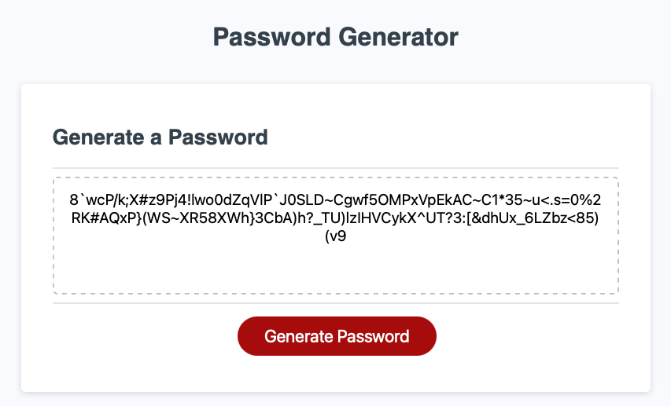

# Password Generator

This is a password generator. You can choose the length of the password and the character set to include. There are four types of character set, lower case, upper case, numeric and special characters. You have to select at least one character set to generate the password; otherwise you will be asked to selecte again.

## Start
Click the Generate Password button to start.

## Prompt
You will be asked to enter the password criteria. The screenshot shows an example of length input.

## Output
Once you finish entering the criteria correctly the generated password will be displayed in the text area.

